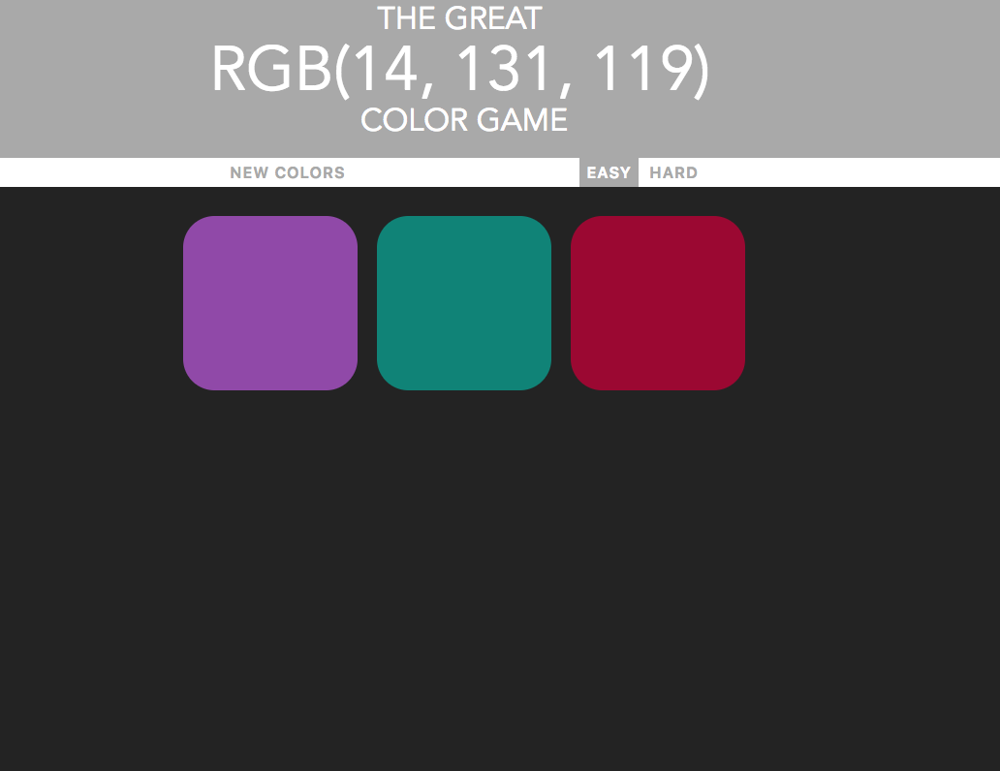
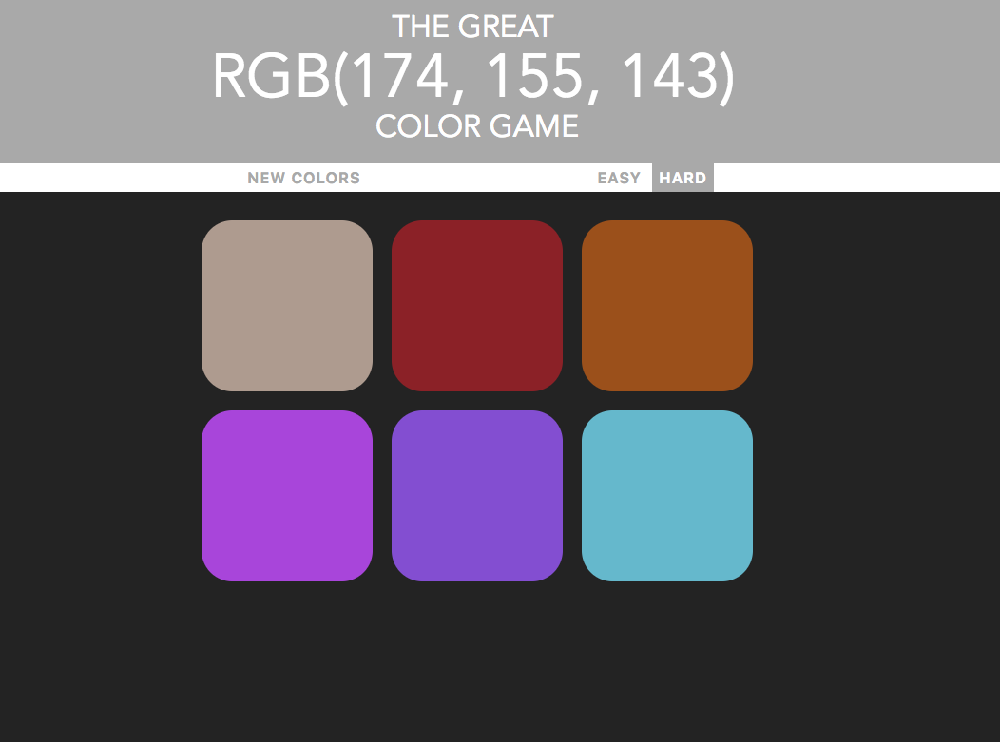
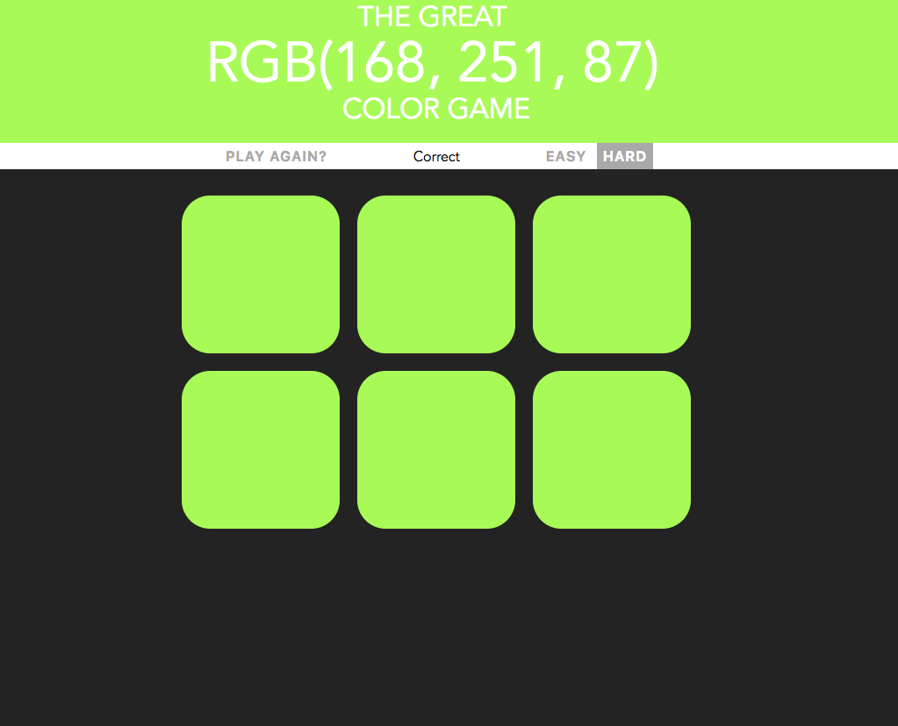

# RGB Color Game
- My fun and simple javaScript GAme

## Objective

- Try to find the color printed at the top of the page
- poke the colors to find out!

## Modes
- Hard 6 Squares
- Easy 3 Squares

## Technology Used:

1. HTMl
2. CSS
3. JavaScript

